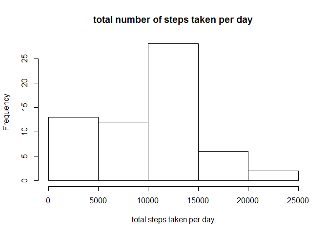
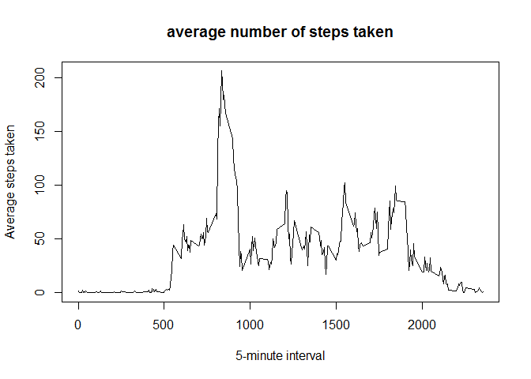
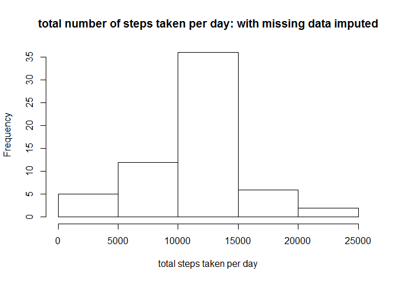
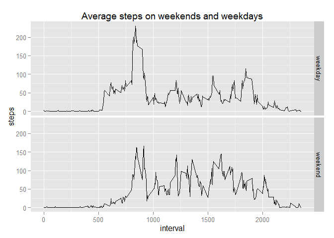

# Reproducible Research: Peer Assessment 1


## Loading and preprocessing the data

```r
require(ggplot2)
```

```
## Loading required package: ggplot2
```

```r
require(dplyr)
```

```
## Loading required package: dplyr
## 
## Attaching package: 'dplyr'
## 
## The following objects are masked from 'package:stats':
## 
##     filter, lag
## 
## The following objects are masked from 'package:base':
## 
##     intersect, setdiff, setequal, union
```

```r
dataset<-read.csv("activity.csv",header=TRUE)
dataset.date<-as.Date(dataset$date)
```


## What is mean total number of steps taken per day?

```r
ds2<-group_by(dataset,date)
totalSteps<-summarize(ds2,sum(steps,na.rm=TRUE))
colnames(totalSteps)<-c("date","steps")
hist(totalSteps$steps,xlab="total steps taken per day",main="total number of steps taken per day")
```

 

```r
meanSteps<-mean(totalSteps$steps,na.rm=TRUE)
meanSteps
```

```
## [1] 9354.23
```

```r
medianSteps<-median(totalSteps$steps,na.rm=TRUE)
medianSteps
```

```
## [1] 10395
```

## What is the average daily activity pattern?

```r
ds3<-group_by(na.omit(dataset),interval)
avgSteps<-summarize(ds3,mean(steps))
colnames(avgSteps)<-c("interval","avgSteps")
plot(avgSteps,type="l",xlab="5-minute interval",ylab="Average steps taken",main="average number of steps taken")
```

 

```r
maxSteps<-max(avgSteps$avgSteps)
maxSteps
```

```
## [1] 206.1698
```

```r
maxStepsInterval<-avgSteps[avgSteps$avgSteps==maxSteps,1]
maxStepsInterval
```

```
## Source: local data frame [1 x 1]
## 
##   interval
##      (int)
## 1      835
```
## Imputing missing values

```r
#naList<-which(is.na(dataset)==TRUE) 
naList<-is.na(dataset)
numNA<-length(naList)
```
number of missing values:

```r
numNA
```

```
## [1] 52704
```
fill in missing values with interval averages.

```r
 getIntervalAvg <- function(intrvl,stps) {
   if (is.na(stps)) as.numeric(avgSteps[avgSteps$interval==intrvl,2]) else stps
 }

filled<-dataset
filled$steps<-mapply(getIntervalAvg,filled$interval,filled$steps)
```
calculate average steps taken each day, with missing data filled in

```r
ds4<-group_by(filled,date)
totalSteps<-summarize(ds4,sum(steps))
colnames(totalSteps)<-c("date","steps")
hist(totalSteps$steps,xlab="total steps taken per day",main="total number of steps taken per day: with missing data imputed")
```

 

```r
meanSteps<-mean(totalSteps$steps,na.rm=TRUE)
meanSteps
```

```
## [1] 10766.19
```

```r
medianSteps<-median(totalSteps$steps,na.rm=TRUE)
medianSteps
```

```
## [1] 10766.19
```
Mean and median are higher than they were before imputing missing data. 

## Are there differences in activity patterns between weekdays and weekends?

populate weekday factor:

```r
 getweekendweekday <- function(dt) {
   if (weekdays(dt) %in% c("Sunday","Saturday")) return ("weekend") else return("weekday")
 }

filled$date<-as.Date(filled$date)
filled$weekday<-sapply(filled$date,getweekendweekday)
filled$weekday<-as.factor(filled$weekday)
```
create a plot

```r
ds5<-group_by(filled,interval,weekday)

avgStepsWeekday<-summarize(ds5,mean(steps))
colnames(avgStepsWeekday)<-c("interval","weekday","steps")

g <- ggplot (avgStepsWeekday, aes(interval,steps))
p<- g + geom_line() + facet_grid(weekday ~ .) + labs (title="Average steps on weekends and weekdays") + labs (y="steps", x="interval")
print(p)
```

 
